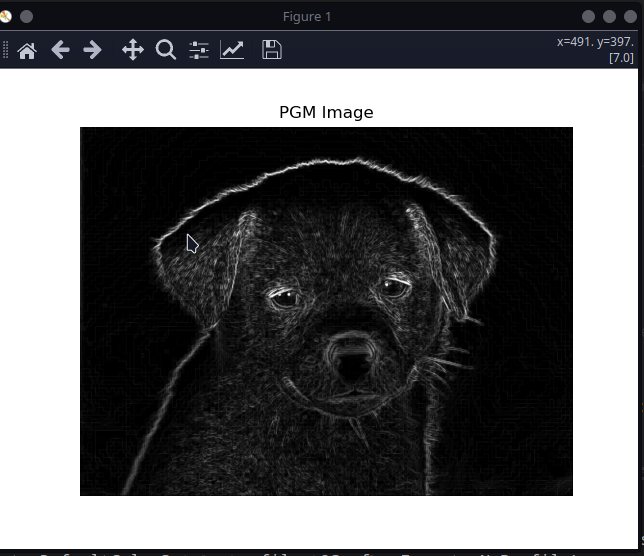

# CUDA Sobel Edge Detection Tool

This project applies the **Sobel edge detection** algorithm to grayscale images using **C++ with CUDA** for GPU acceleration. It processes `.pgm` images (Portable GrayMap format) and outputs the detected edges into a separate `.pgm` file.

## Example

**Input Image (PGM):**


**Output Image (Edges):**


##  Features

- Parallel edge detection using CUDA kernels.
- Input/output image support via `.pgm` format.
- Lightweight and fast for high-resolution grayscale images.
- Python tools provided for image conversion and visualization.

---

## Sobel Filter Overview

The Sobel operator detects edges by convolving the image with two 3×3 kernels:

## Build & Run

### Requirements

- **CUDA Toolkit** (Tested with CUDA 11.4+)
- `nvcc` compiler
- Python 3 (optional: for image viewing)
- Pillow and Matplotlib (for `view_pgm.py`)

Install Python dependencies (optional for visualization):

```bash
pip install -r requirements.txt
```
Change directory to src and convert image to pmg format by:
```bash
cd src
python convert_to_pgm.py yourimage.jpg input/image.pgm
```
Next you can compile and run the edge detection tool via:
```
make
./sobel ./input/image.pgm ./output/result.pgm
```
You can also view the image after that via python script :
```
python view_pmg.py
```
